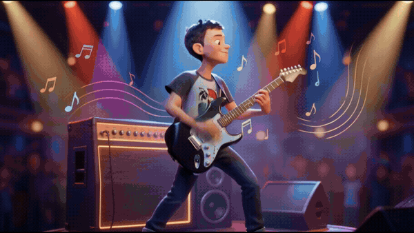
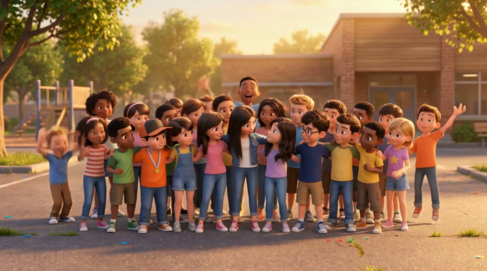
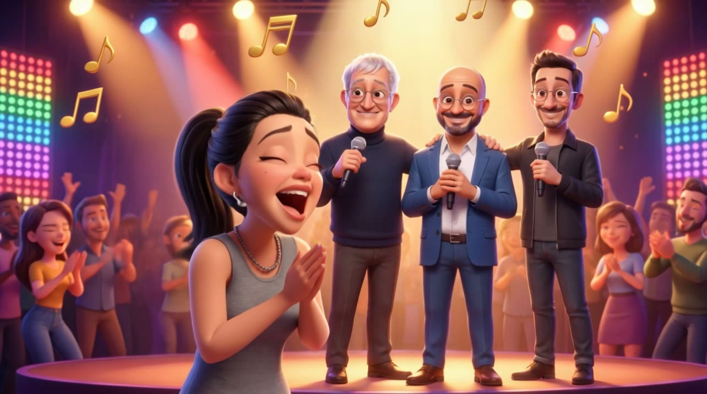
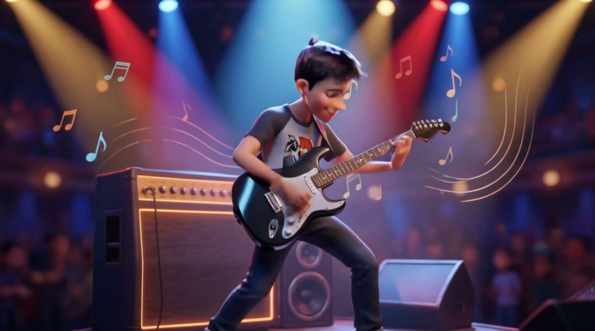

<div align="center">

<pre>
██████╗  ██████╗ ███████╗███████╗ █████╗ ██╗
██╔══██╗██╔═══██╗██╔════╝██╔════╝██╔══██╗██║
██████╔╝██║   ██║█████╗  █████╗  ███████║██║
██╔══██╗██║   ██║██╔══╝  ██╔══╝  ██╔══██║██║
██║  ██║╚██████╔╝███████╗███████╗██║  ██║██║
╚═╝  ╚═╝ ╚═════╝ ╚══════╝╚══════╝╚═╝  ╚═╝╚═╝
</pre>

# 🎬 סרט כיתה בסגנון פיקסאר — סקיל שלב-אחר-שלב

🇬🇧 [English README](README.md)



</div>

<div dir="rtl" align="right">

**הופכים תמונות וחוביות של ילדי הכיתה לסרט סוף-שנה מרהיב בסגנון פיקסאר.**
כל ילד הופך לדמות תלת-ממד נאמנה למקור, עם סצנות תחביב מונפשות, כרטיסי כותרת בעברית (RTL),
שילוב של תמונות אמיתיות, פסקול שמתחלף כל הזמן, סצנת סיום של כל הכיתה — וטריילר קצר להורים.

---

## ✨ מה זה

זהו **סקיל** ל-[Claude Code](https://claude.com/claude-code) שמתפקד כ*במאי* שלכם.
הוא מלווה אתכם **שלב אחרי שלב** — שואל מה לעשות בכל שלב במקום לנחש — ומפעיל את
שרת ה-MCP של [Higgsfield](https://higgsfield.ai) (יצירת תמונות ווידאו) יחד עם `ffmpeg`
כדי להפיק סרט מלוטש באורך ~7–10 דקות.

הסקיל מקפל בתוכו את כל מה שנלמד מהפקת סרט כיתה אמיתי: איך לגרום לדמויות **באמת להיראות
כמו הילדים**, אילו מלכודות פרומפט להימנע מהן, כרטיסי כותרת בעברית, פסקול שלא נהיה משעמם,
ושיטת הרכבה שלא "בולעת" לכם את הסוף בשקט.

תוספות אופציונליות שאפשר להפעיל: **קריינות** (טקסט-לדיבור, או **שכפול הקול** של המשתמש),
**סנכרון שפתיים** כך שדמות שעל המסך "מדברת" את הטקסט, ו**כתוביות / טקסט על הסצנות** — הכול
תומך RTL.

<div align="center">



</div>

## 🧭 איך האשף עובד

| שלב | מה קורה (אתם מאשרים כל צעד) |
|---:|---|
| **0. הגדרה והיקף** | בדיקת כלים, יצירת תיקיית עבודה, ושאלות על שפה / אורך / מוזיקה / כמה סצנות לכל ילד. |
| **1. רשימת הכיתה** | אתם מספקים לכל ילד: שם, תמונת פנים, ו-1–3 תחביבים. |
| **2. לכל ילד** | חיתוך פנים ← **דף דמות** ← *"זה דומה לו/לה?"* ← סצנות תחביב ← הנפשה. |
| **3. כרטיסים וכתוביות** | כרטיסי כותרת בעברית/RTL + כתוביות/טקסט על הסצנות (כולל מלכודת הספרות וה-`?`). |
| **4. קבוצות ותמונות אמיתיות** | סצנת סיום כיתתית, שחזור אירועים, ושילוב תמונות אמיתיות. |
| **5. אודיו** | מוזיקה (תמיד) + **קריינות אופציונלית** (TTS / קול משוכפל) + **סנכרון שפתיים אופציונלי**. |
| **6. הרכבה ואימות** | רינדור במקטעים או עם קריינות, ואז **לוודא שאורך הווידאו == אורך האודיו**. |
| **7. טריילר** | טריילר רשות של 15–20 שניות להורים (0 קרדיטים של יצירה). |

## 🚀 התקנה (כסקיל של Claude Code)

```bash
git clone https://github.com/roeea2/pixar-class-video-skill.git \
  ~/.claude/skills/pixar-class-video
```

ואז ב-Claude Code פשוט אמרו *"בוא נכין סרט סוף שנה לכיתה בסגנון פיקסאר"* או הריצו `/pixar-class-video`.

## 🧰 דרישות

- **Claude Code** עם **Higgsfield MCP** מחובר (יצירת תמונות/וידאו + קרדיטים).
- `ffmpeg` ו-`ffprobe` ב-PATH.
- `python3` עם **Pillow** (`pip install pillow`) עבור כרטיסי הכותרת.
- פונט שתומך בעברית לכרטיסי RTL (ב-macOS מובנה *SF Hebrew Rounded*).

## 🔑 הלקחים החשובים (כדי שהסרט יצא מצוין)

- **דמיון לפני הכול** — ציינו את הגיל האמיתי, מבנה הפנים, צבע שיער/עיניים מדויק, ובקשו *"סטילול עדין בלבד"*. אשרו כל דף דמות לפני בניית סצנות.
- **תנו לרפרנס להגדיר את המראה** — אחרי שדף הדמות נעול, העבירו אותו לכל סצנה ותארו רק את *הפעולה*; חזרה על שיער/בגדים/גיל בפרומפט מייצרת בשקט אדם שנראה אחרת.
- **שער אישור אחד לכל תוצר** — מראה → כל סצנה → הנפשה → קול → סנכרון שפתיים → הרכבה. אישור על סטיל זול חוסך רינדור חוזר של כל הקליפים היקרים אחריו.
- **בקשו מפתחות מראש** — אם הקריינות צריכה מפתח ElevenLabs, בקשו אותו לפני שמתחילים; אל תשמרו אותו ב-repo וסובבו אותו אחרי.
- **ילד אחד בכל סצנת יחיד** — אחרת המודל משכפל אותו.
- **לוודא כל רינדור** — שרשרת `xfade` ארוכה עלולה "לחתוך" את הסוף בשקט (גם כש-rc=0!). תמיד השוו את אורך זרם הווידאו לאורך זרם האודיו.
- **קהל/קבוצות** — הורידו את המילה *"diverse"*; ציינו את המראה האמיתי של הכיתה, אחרת מתווספות דמויות אקראיות שלא מתאימות.
- **רוטציית מוזיקה** — החליפו בין כמה רצועות כל ~55 שניות כדי שסרט ארוך לא ישעמם.

## 🔒 פרטיות

הסרטים מציגים **ילדים אמיתיים**. הסקיל לא מעלה תמונות לשום מקום מלבד שירות היצירה שאתם בוחרים,
ומזהיר לפני הצגת פנים אמיתיות בכל מקום ציבורי. התצוגה המקדימה למעלה היא **איור פיקסאר מסוגנן בלבד** —
אין בריפו הזה תמונות אמיתיות. שמרו את הסרט המוגמר בתוך קהילת הכיתה.

## 🙏 קרדיטים

נבנה עם [Claude Code](https://claude.com/claude-code), שרת ה-MCP של [Higgsfield](https://higgsfield.ai),
ו-`ffmpeg`. מוזיקה בתהליך הייחוס: *Kevin MacLeod* (incompetech.com), רישיון CC-BY 4.0.

נוצר על-ידי **RoeeAI**. רישיון [MIT](LICENSE).

</div>
